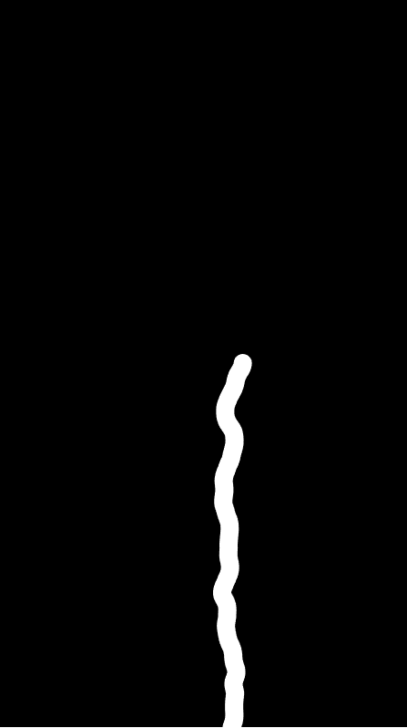
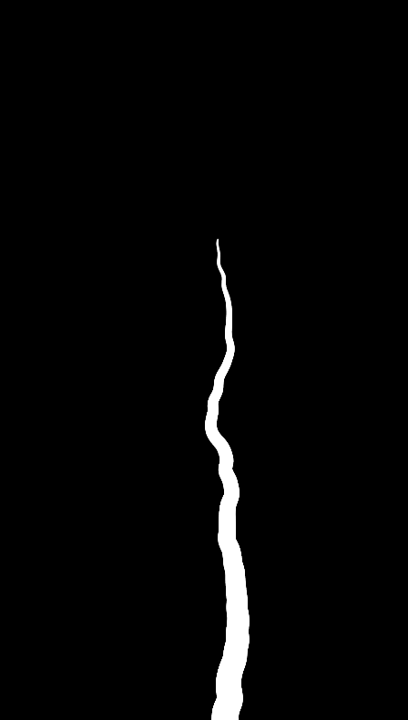
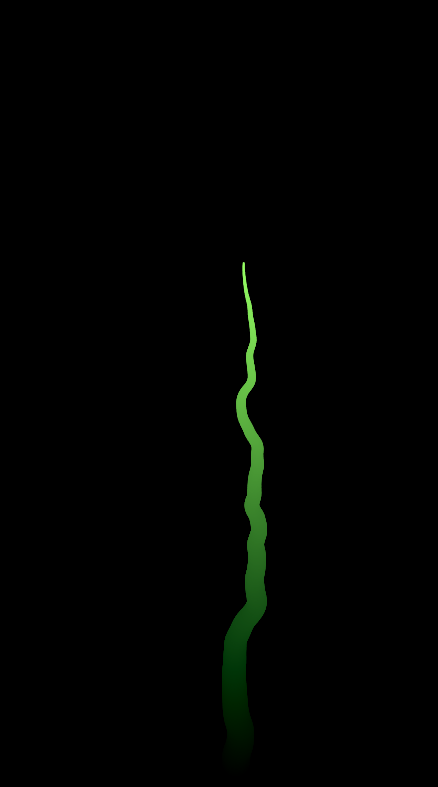
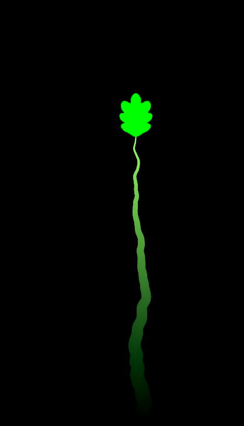
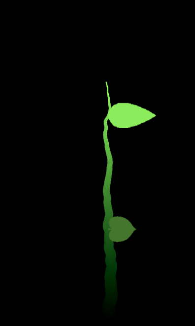

# Unidad 1: Aletoriedad

## Entrega:

- **Festival:** Fotosintesis
- **Aplicacion:** Una pantalla vertical con una planta que crece de forma aleatoria (el tallo se mueve de lado a lado usando ruido perlin), que cada tanto pone una hoja con un intervalo (usando distribucion gausiana) y usando un algoritmo de distribucion uniforme para elegir la hoja que se coloca.
- **Interactividad:** cuando se hunde la pantalla la planta crece mas rapido

## iteraciones:

1.  Ya crece pero quiero que se vea mas gruesa en la base y mas delgada en la punta.
2.  Con ayuda de claude, ahora el tallo es mas grueso en la base, antes fucionaba con la funcion ``beginshape()`` de P5js, ahora usa la funcion ``line()``
3.  Color gradual para que paresca una planta infinita
4.  Ya hay hojas pero no siguen el tallo
5.  las hojas siguen el tallo y estan rotadas para que se vean mejor, tambien cambian de color mientras bajan